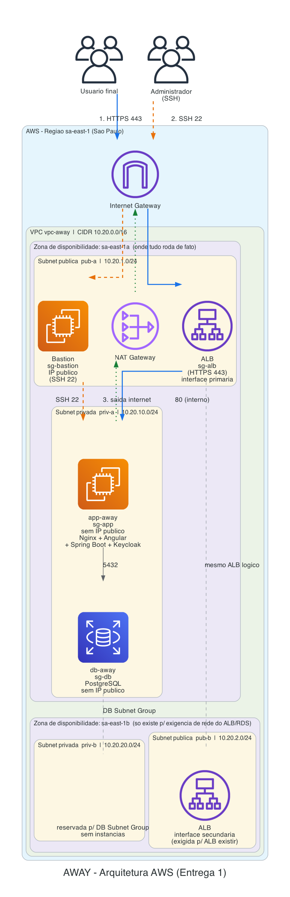

# Projeto de Arquitetura — AWAY na AWS

## 5.1 Descrição da aplicação

**Problema que resolve:** O AWAY é um sistema de gestão para um patronato penitenciário: controla o cadastro de assistidos (pessoas em cumprimento de pena em regime aberto/semiaberto), o registro de comparecimentos obrigatórios, o cadastro de usuários do sistema (funcionários e administradores) e a documentação associada a cada assistido.

**Usuários:** Funcionários e administradores da instituição, todos internos, não há usuário público/anônimo. Uso concentrado em horário comercial, de segunda a sexta.

**Funcionalidades principais**
- CRUD de assistidos (cadastro, edição, listagem, exclusão)
- Registro e consulta de comparecimentos
- CRUD de usuários com dois perfis (ADMIN, FUNCIONARIO)
- Autenticação e autorização baseada em papéis

**Componentes técnicos**
- **Frontend**: SPA em Angular, servida como arquivos estáticos por Nginx.
- **Backend**: API REST em Spring Boot (Java 17), rodando na mesma instância que o Nginx (proxy reverso local).
- **Banco de dados**: PostgreSQL, gerenciado (Amazon RDS).
- **Autenticação**: Keycloak, containerizado, rodando na mesma instância da aplicação.

**Requisitos não funcionais assumidos**
- **Usuários simultâneos**: baixo (estimativa de 5 a 15 usuários simultâneos em horário de pico), compatível com uma instituição de porte pequeno/médio.
- **Disponibilidade esperada**: **esta entrega não oferece alta disponibilidade.** Toda a computação e os dados ficam em uma única zona de disponibilidade (`sa-east-1a`): uma única instância de aplicação e um banco de dados single-AZ. Uma segunda AZ (`sa-east-1b`) existe na rede apenas para satisfazer exigências estruturais da AWS (o Application Load Balancer exige subnets em pelo menos duas AZs, e o DB Subnet Group do RDS também — ver seção 5.3), mas não há nenhuma instância, réplica nem failover real rodando nela. Uma falha de instância, da AZ `sa-east-1a` ou uma janela de manutenção do RDS single-AZ derruba o sistema até recuperação manual ou automática (RDS) — ver seção 5.10 (Riscos).
- **Consistência de dados**: forte (RDS PostgreSQL, transacional), sem necessidade de consistência eventual.

## 5.2 Diagrama de arquitetura

Fonte editável (draw.io/diagrams.net): [`diagramas/arquitetura.drawio`](diagramas/arquitetura.drawio) — pode ser aberto em [app.diagrams.net](https://app.diagrams.net) ou no draw.io desktop.

O diagrama contém:
- Provedor (AWS), região (`sa-east-1` — São Paulo) e duas zonas de disponibilidade: `sa-east-1a` (onde roda toda a computação e os dados) e `sa-east-1b` (existe só para satisfazer os requisitos de rede do ALB e do RDS — ver seção 5.3).
- VPC `vpc-away` com CIDR `10.20.0.0/16`.
- Quatro sub-redes: `pub-a` (`10.20.1.0/24`) e `priv-a` (`10.20.10.0/24`) em `sa-east-1a`; `pub-b` (`10.20.2.0/24`) e `priv-b` (`10.20.20.0/24`) em `sa-east-1b`.
- Internet Gateway e NAT Gateway.
- Instâncias/serviços com sub-rede, tipo e IP público indicados: Bastion (pública, `pub-a`, IP público), ALB (pública, com uma interface em `pub-a` e outra em `pub-b` — exigência da AWS, não escolha de HA —, IP público/DNS), instância de aplicação `app-away` (privada, `priv-a`, sem IP público), RDS `db-away` (privada, associada a um DB Subnet Group que inclui `priv-a` e `priv-b`, mas rodando fisicamente só em `priv-a`, sem IP público). `priv-b` não tem nenhuma instância nem réplica — existe vazia, reservada apenas para o DB Subnet Group.
- Grupos de segurança aplicados a cada recurso (`sg-bastion`, `sg-alb`, `sg-app`, `sg-db`).
- Três fluxos numerados:
  1. **Usuário final** → Internet Gateway → ALB (HTTPS 443) → instância de aplicação (porta 80, interno).
  2. **Administrador via SSH** → Internet Gateway → Bastion (porta 22) → instância de aplicação (porta 22, só a partir do bastion).
  3. **Instância privada acessando a internet pelo NAT** → instância de aplicação → NAT Gateway → Internet Gateway (atualizações de pacotes, imagens Docker, chamadas externas).

## 5.3 Plano de endereçamento IP

| Recurso | Nome | CIDR | Zona | Tipo | Finalidade |
|---|---|---|---|---|---|
| Rede virtual | `vpc-away` | `10.20.0.0/16` | - | - | Rede do projeto |
| Sub-rede | `pub-a` | `10.20.1.0/24` | `sa-east-1a` | Pública | Bastion, NAT Gateway, ALB (interface primária) |
| Sub-rede | `priv-a` | `10.20.10.0/24` | `sa-east-1a` | Privada | Aplicação (`app-away`), banco (`db-away`) |
| Sub-rede | `pub-b` | `10.20.2.0/24` | `sa-east-1b` | Pública | ALB (segunda interface — exigência da AWS) |
| Sub-rede | `priv-b` | `10.20.20.0/24` | `sa-east-1b` | Privada | Reservada para o DB Subnet Group do RDS; sem instâncias |

**Por que existem `pub-b` e `priv-b` se a arquitetura é single-AZ.** Dois serviços gerenciados da AWS têm uma exigência estrutural de rede que independe de a arquitetura ser ou não de alta disponibilidade:
- um **Application Load Balancer precisa de subnets em pelo menos duas zonas de disponibilidade** para ser criado, mesmo que só exista um alvo (target) rodando em uma delas;
- um **RDS precisa de um DB Subnet Group que cubra pelo menos duas AZs**, mesmo quando a instância do banco é Single-AZ (não Multi-AZ).

Por isso `pub-b` e `priv-b` existem na rede, mas **nenhuma instância de aplicação nem réplica de banco roda nelas** — `priv-b` fica vazia, e `pub-b` só hospeda a segunda interface de rede do ALB. Isso não é alta disponibilidade real (ver seção 5.1 e 5.10): se `sa-east-1a` cair, a aplicação e o banco caem juntos, porque é lá que eles de fato rodam.

**Justificativa dos tamanhos.**
- **VPC `/16`** (65.536 endereços): folga generosa para a Entrega 2, que deve expandir o uso de `sa-east-1b` (e talvez adicionar uma terceira AZ) para alta disponibilidade real, sem precisar renumerar a rede existente.
- **Sub-redes `/24`** (256 endereços cada, 251 utilizáveis): nesta entrega há poucos recursos (bastion, NAT Gateway, ALB, a instância de aplicação e o RDS), mas um `/24` é o menor tamanho que ainda deixa espaço confortável para o ALB (que pode consumir múltiplos ENIs ao escalar) e para futuras instâncias, sem risco de esgotar endereços.
- **Sem sobreposição**: `10.20.1.0/24`, `10.20.2.0/24`, `10.20.10.0/24` e `10.20.20.0/24` não se sobrepõem entre si nem com o restante do bloco `/16`.

**Endereços reservados pela AWS.** Em cada sub-rede a AWS reserva 5 endereços (não disponíveis para uso): o endereço de rede, o roteador da VPC (+1), o DNS da Amazon (+2), um endereço reservado para uso futuro (+3) e o endereço de broadcast (último, embora VPCs não usem broadcast). Em uma sub-rede `/24` isso deixa **251 endereços utilizáveis**.

## 5.4 Tabelas de rota

| Sub-rede | Destino | Alvo |
|---|---|---|
| `pub-a` (pública) | `10.20.0.0/16` | local |
| `pub-a` (pública) | `0.0.0.0/0` | Internet Gateway |
| `pub-b` (pública) | `10.20.0.0/16` | local |
| `pub-b` (pública) | `0.0.0.0/0` | Internet Gateway |
| `priv-a` (privada) | `10.20.0.0/16` | local |
| `priv-a` (privada) | `0.0.0.0/0` | NAT Gateway (em `pub-a`) |
| `priv-b` (privada) | `10.20.0.0/16` | local |
| `priv-b` (privada) | `0.0.0.0/0` | NAT Gateway (em `pub-a`) |

`pub-a`/`pub-b` compartilham a mesma tabela de rotas ("pública"), e `priv-a`/`priv-b` compartilham a mesma tabela "privada" — não é necessário criar quatro tabelas distintas, duas bastam (uma associada às duas sub-redes públicas, outra às duas privadas).

**O que aconteceria sem a rota `0.0.0.0/0 → NAT Gateway` na sub-rede privada:** a instância de aplicação continuaria acessível internamente (ALB conseguiria alcançá-la, o bastion conseguiria SSH nela, ela conseguiria falar com o RDS — tudo isso via a rota `local`), mas perderia qualquer capacidade de iniciar conexões para fora da VPC. Na prática, `apt update`, download de imagens Docker, ou qualquer chamada a um serviço externo feita pela aplicação falhariam por timeout, já que os pacotes de resposta não teriam como retornar sem um caminho de saída roteável para a internet.

## 5.5 Matriz de regras de segurança

| Grupo de segurança | Direção | Protocolo | Porta | Origem/Destino | Justificativa |
|---|---|---|---|---|---|
| `sg-bastion` | Entrada | TCP | 22 | IP público do administrador (`/32`) | Acesso administrativo restrito a quem de fato administra a infraestrutura — nunca aberto à internet. |
| `sg-alb` | Entrada | TCP | 443 | `0.0.0.0/0` | Acesso público HTTPS ao sistema (é o componente que precisa ficar exposto à internet). |
| `sg-alb` | Entrada | TCP | 80 | `0.0.0.0/0` | Redirecionamento automático para HTTPS (443); nenhum dado de aplicação trafega em texto plano nesta porta. |
| `sg-app` | Entrada | TCP | 80 | `sg-alb` | A instância de aplicação só aceita tráfego HTTP vindo do próprio ALB, nunca diretamente da internet. |
| `sg-app` | Entrada | TCP | 22 | `sg-bastion` | SSH liberado apenas a partir do bastion — nunca de `0.0.0.0/0`. |
| `sg-db` | Entrada | TCP | 5432 | `sg-app` | O PostgreSQL só aceita conexões vindas da aplicação; nenhuma outra origem, nem mesmo o bastion, tem acesso direto ao banco. |

**Princípio do menor privilégio aplicado.** Toda regra de entrada entre componentes internos referencia outro *security group* (não uma faixa de IP), de forma que a regra continua correta mesmo se o IP interno do recurso mudar (ex.: reinicialização da instância). SSH nunca é liberado para `0.0.0.0/0` em nenhum grupo — é o requisito obrigatório da disciplina e também a prática correta: uma porta 22 aberta ao mundo é o vetor de ataque mais comum contra instâncias EC2 recém-criadas.

## 5.6 Tecnologias

| Camada | Tecnologia | Versão | Justificativa |
|---|---|---|---|
| Provedor e região | AWS, `sa-east-1` (São Paulo) | - | Os usuários do AWAY são funcionários de uma instituição no Brasil; `sa-east-1` reduz a latência percebida em relação a `us-east-1`. A região oferece toda a disponibilidade de serviços exigida nesta entrega (VPC, NAT Gateway, RDS, EC2, ALB). O custo em `sa-east-1` é mais alto que em `us-east-1` (ex.: o NAT Gateway custa quase o dobro por hora) — aceitamos esse custo adicional em troca de melhor latência para os usuários reais, já que o sistema não é público/global. |
| Sistema operacional | Ubuntu Server | 22.04 LTS | Suporte de longo prazo (LTS até 2027), ampla documentação, bom suporte a Docker/containers. |
| Runtime / linguagem | Java (Temurin/OpenJDK) | 17 | Versão exigida pelo backend Spring Boot já existente do grupo. |
| Servidor web / proxy | Nginx | 1.24+ | Serve os arquivos estáticos do Angular e faz proxy reverso para a API Spring Boot na mesma instância; leve o suficiente para rodar junto com a aplicação sem competir por recursos. |
| Banco de dados | PostgreSQL (Amazon RDS) | 16 | Mesma versão já usada em desenvolvimento local pelo grupo; RDS gerenciado evita que o grupo administre backup e patch do SO do banco (ver ADR-003). |
| Infraestrutura como código | Terraform | 1.9+ | Ferramenta madura, maior volume de documentação e exemplos disponíveis; usada na Entrega 2 para traduzir este projeto em código. |
| Provider do Terraform | `hashicorp/aws` | `~> 5.0` | Provider oficial mantido pela HashiCorp/AWS, com suporte completo a VPC, sub-redes, NAT Gateway, EC2, RDS e ALB. |
| Instalação da aplicação | cloud-init | - | Script executado na inicialização da instância, que instala Docker, sobe os containers do backend e do Keycloak e configura o Nginx — permite recriar o ambiente do zero automaticamente (ver seção 5.9, plano de controle de custos). |

## 5.7 Dimensionamento das instâncias

| Componente | Família | Tipo | vCPU | Memória | Disco | Sub-rede | Justificativa |
|---|---|---|---|---|---|---|---|
| Bastion | t4g (ARM, créditos de CPU) | `t4g.nano` | 2 | 0,5 GiB | gp3, 8 GB | `pub-a` | Uso puramente esporádico (só quando alguém precisa dar SSH para manutenção); não roda nenhum serviço além do SSH. O menor tamanho disponível já atende com folga; não há por que pagar por mais. |
| Aplicação | t4g (ARM, créditos de CPU) | `t4g.small` | 2 | 2 GiB | gp3, 20 GB | `priv-a` | A instância roda simultaneamente Nginx, o backend Spring Boot (JVM) e o Keycloak em container — só a JVM já costuma consumir várias centenas de MB; 2 GiB é o mínimo realista para os três processos coexistirem sem *swapping* constante. Um `t4g.micro` (1 GiB) seria insuficiente. |
| Banco de dados | t4g (ARM, créditos de CPU) | `db.t4g.micro` | 2 | 1 GiB | gp3, 20 GB | `priv-a` | Carga de banco baixa (poucos usuários simultâneos, consultas simples de CRUD); 1 GiB de memória é suficiente para o *working set* do PostgreSQL nesse volume de dados. |

**Comportamento ao esgotar os créditos de CPU (família `t4g`, `Unlimited` desativado por padrão).** Todas as instâncias escolhidas são da família `t4g`, que usa CPU compartilhada com um saldo de créditos: a instância acumula créditos quando está ociosa e os gasta quando processa acima da linha de base (definida por tamanho). Em modo padrão (*Standard*, sem *T4g Unlimited*), se os créditos acabarem durante um pico de uso sustentado, a instância é **limitada (throttled)** à performance da linha de base (não é desligada nem perde dados) — na prática, requisições ficam mais lentas até o saldo de créditos se recompor. Dado o perfil de uso do AWAY (uso interno, picos curtos de CRUD, não processamento contínuo), esse é um trade-off aceitável: o grupo prioriza o custo baixo das instâncias `t4g` sobre a garantia de performance constante que uma família de uso geral (ex.: `m6g`) ofereceria a um custo maior.

## 5.9 Estimativa de custos

Estimativa construída na **AWS Pricing Calculator** (calculadora oficial). Link compartilhável: **https://calculator.aws/#/estimate?id=fb1b3c28d751b636a26f5e3a5a9c6ac242df4a17**. Exportação em PDF: [`custos/estimativa.pdf`](custos/estimativa.pdf).

### Cenário A — operação contínua (730 h/mês)

| Item de custo | Serviço | Custo mensal (USD) |
|---|---|---|
| `nat-away` | NAT Gateway | **68,82** |
| `db-away` | RDS PostgreSQL (`db.t4g.micro`, single-AZ, 20 GB gp3) | 29,20 |
| `alb-away` | Application Load Balancer | 25,14 |
| `app-away` | EC2 `t4g.small` + 20 GB gp3 | 22,60 |
| `bastion` | EC2 `t4g.nano` + 8 GB gp3 | 6,11 |
| **Total** | | **151,87 USD/mês** (≈ 1.822,44 USD/ano) |

**Item mais caro: o NAT Gateway (68,82 USD/mês, 45,3% do total).** O custo vem quase inteiramente da cobrança por hora (0,093 USD/h em `sa-east-1`, quase o dobro do valor em `us-east-1`), não do volume de dados processados (que é mínimo — 10 GB/mês estimados).

**Como reduzi-lo, e o que se perde.** A alternativa mais direta é substituir o NAT Gateway gerenciado por uma **NAT instance** — uma EC2 pequena (`t4g.nano`, ~6 USD/mês) configurada manualmente para fazer NAT. Isso derrubaria esse item de ~69 USD para ~6-8 USD/mês. O custo dessa redução: o grupo passa a ser responsável por aplicar patches de segurança no SO da NAT instance, ela vira um ponto único de falha sem failover automático (o NAT Gateway gerenciado da AWS já é resiliente dentro da própria AZ), e o rendimento de rede é limitado pelo tamanho da instância escolhida. Por isso mantivemos o NAT Gateway gerenciado nesta entrega (é, aliás, exigido pelo enunciado) — ver ADR-002 para a análise completa dessa troca.

**Nível gratuito considerado.** Não contamos com o *Free Tier* para as instâncias EC2: o *free tier* tradicional de 12 meses cobre apenas `t2.micro`/`t3.micro`, não a família `t4g` usada aqui. Já o RDS `db.t4g.micro` **é elegível** ao *free tier* de 750h/mês nos primeiros 12 meses de uma conta AWS nova (single-AZ, até 20 GB) — se a conta do grupo ainda estiver dentro desse período, o custo real do banco poderia ser 0 USD, reduzindo o total do Cenário A para ~122,67 USD/mês. Não assumimos isso como garantido porque depende da idade/elegibilidade da conta usada na Entrega 2.

### Cenário B — período de trabalho da Entrega 2

**Premissa assumida** (a ser ajustada quando o cronograma real de testes for definido): o grupo liga o ambiente apenas durante sessões de teste, estimadas em **30 horas totais** entre a implantação inicial e a apresentação de 23/11 (por exemplo: ~3 sessões de 3h por semana ao longo de 3 semanas, mais a apresentação).

Como o NAT Gateway e o Application Load Balancer não têm opção de "utilização parcial" na calculadora (são cobrados como se estivessem sempre ativos no mês), o Cenário B foi obtido aplicando a taxa horária de cada item (custo mensal do Cenário A ÷ 730h) às 30 horas assumidas:

| Item | Custo/hora (USD) | 30 h (USD) |
|---|---|---|
| NAT Gateway | 0,0943 | 2,83 |
| RDS PostgreSQL | 0,0400 | 1,20 |
| Application Load Balancer | 0,0344 | 1,03 |
| EC2 aplicação | 0,0310 | 0,93 |
| EC2 bastion | 0,0084 | 0,25 |
| **Total** | | **≈ 6,24 USD** |

Esse é o valor que o grupo efetivamente pagaria pela Entrega 2, dado que o ambiente é destruído entre as sessões de trabalho (ver plano de controle de custos abaixo).

**Plano de controle de custos.**
- **Alerta de orçamento**: configurar um AWS Budget de 20 USD/mês (margem confortável acima dos ~6,24 USD esperados no Cenário B) com notificação por e-mail a 50%, 80% e 100% — serve para pegar erro de configuração (ex.: alguém esquecer o ambiente ligado) antes que vire uma surpresa na fatura.
- **Destruição do ambiente entre sessões de teste**: o grupo adota `terraform destroy` ao final de cada sessão de trabalho e `terraform apply` no início da próxima. Como a instalação da aplicação é automatizada via cloud-init (seção 5.6), recriar o ambiente não exige reconfiguração manual — o trade-off aceito é o tempo de inicialização (poucos minutos) a cada sessão, em troca de reduzir o custo real pago de 151,87 USD/mês para ~6,24 USD no período de trabalho.
- **Tags**: todo recurso provisionado via Terraform recebe as tags `Project=away`, `Environment=entrega2` e `Owner=<nome-do-grupo>` (via `default_tags` no provider AWS), facilitando identificar e auditar custo por recurso caso a fatura real destoe do estimado.

## 5.10 Riscos e limitações

1. **Único ponto de falha: toda a computação e os dados estão em uma única zona de disponibilidade (`sa-east-1a`).** Bastion, NAT Gateway, a instância de aplicação e o RDS rodam todos em `sa-east-1a`. A segunda AZ (`sa-east-1b`) existe só porque o ALB e o DB Subnet Group do RDS exigem presença de rede em duas AZs (seção 5.3) — ela não hospeda nenhuma instância nem réplica. Uma interrupção de `sa-east-1a` (rara, mas já aconteceu na AWS) derruba o sistema inteiro simultaneamente, sem failover automático, porque não há nada rodando em `sa-east-1b` para assumir. Impacto: indisponibilidade total até a AZ ser restaurada pela AWS ou até o grupo reconstruir manualmente a infraestrutura em `sa-east-1b`.

2. **Instância de aplicação única, sem redundância.** Não há Auto Scaling nem uma segunda instância atrás do ALB. Se a instância `app-away` falhar (pane de kernel, erro de deploy, instância corrompida), a aplicação inteira fica fora do ar até alguém notar e recriar a instância manualmente — não há health check com substituição automática. Impacto: tempo de indisponibilidade não planejado, dependente de intervenção humana.

3. **RDS single-AZ sem réplica.** O banco de dados não tem Multi-AZ nem réplica de leitura. Uma falha da instância RDS (não da AZ inteira, apenas da instância do banco) é recuperada automaticamente pela AWS a partir do snapshot/backup automático mais recente, mas isso implica uma janela de indisponibilidade durante a recuperação e risco de perda dos dados gravados desde o último snapshot (RPO não-zero).

4. **Bastion como único caminho de acesso administrativo.** Se a chave SSH do bastion for perdida, ou o próprio bastion for destruído/corrompido, a equipe perde o único caminho de administração da infraestrutura privada até recriar o bastion — o que, por sua vez, exige acesso ao console AWS ou ao Terraform (fora da rede da VPC), não à VPC em si.

Estes quatro pontos são o ponto de partida da proposta de alta disponibilidade e do plano de backup exigidos na Entrega 2.
